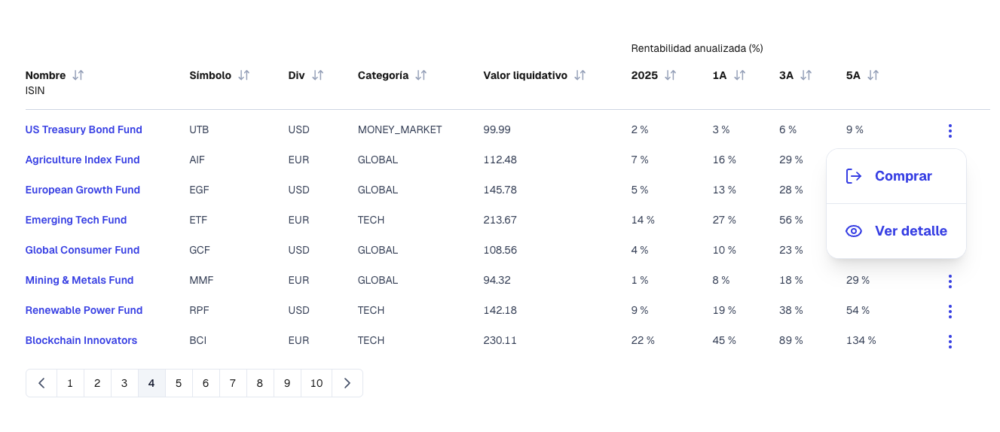

# 📊 Funds Table Challenge

This project is my submission for the coding challenge at My Investor.
It demonstrates a responsive, accessible, and user-friendly data table
implementation, with sorting, pagination, and keyboard-friendly dropdown menus.

---



## ✨ Highlights

### 🔼 **Sortable column headers**

- Three states: **unsorted → ascending → descending**.
- Icons and colors update to reflect the current state.
- Large clickable area (not just the icon) improves usability.
- Focus indicators ensure keyboard accessibility.

### 🎛 **Dropdown menus**

- Fully keyboard accessible.
- Options inside each dropdown are reachable via keyboard navigation.

### 📄 **Pagination**

- Accessible controls with clear focus states.
- Supports wrapping around when navigating pages.

### 📌 **Sticky header on mobile**

- Table header stays visible while scrolling vertically.
- Works alongside horizontal and vertical overflow axis.

### 📱 **Responsive table**

- Horizontal overflow for small screens.
- Minimum width prevents columns from being squished.
- Vertical overflow with sticky header for large datasets.

### 🎨 **Design fidelity**

- Styling inspired by the provided screenshots.
- Dropdown menu position differs slightly to support sticky header + overflow
  reliably.
- Lucide icon pack used to match design references.

---

## 🛠️ Libraries & Frameworks

- **React + TypeScript** – core implementation.
- **Tailwind CSS** – chosen for rapid prototyping, utility-first styling, and
  responsive helpers.
- **Express.js** – reused the provided implementation to serve API data.
- **npm workspaces (monorepo)** – run the whole project with a single command.
- **Vitest** – lightweight test runner for utility functions.
- **Lucide Icons** – for consistent and modern iconography.

---

## ✅ Tests

The only tests added are for utility functions:

- `classNames` helper
- `percent` formatting helper

These small but essential utilities are covered to ensure correctness.

---

## 🚀 Running the Project

1. **Clone the repo**
   ```bash
   git clone <repo-url>
   cd <repo-name>
   ```
2. **Install dependencies**
   ```bash
   npm i
   ```
3. **Start the app** (from the monorepo root)
   ```bash
   npm run dev # runs both server / client apps
   ```
4. **Run test**
   ```bash
   npm run test
   ```
