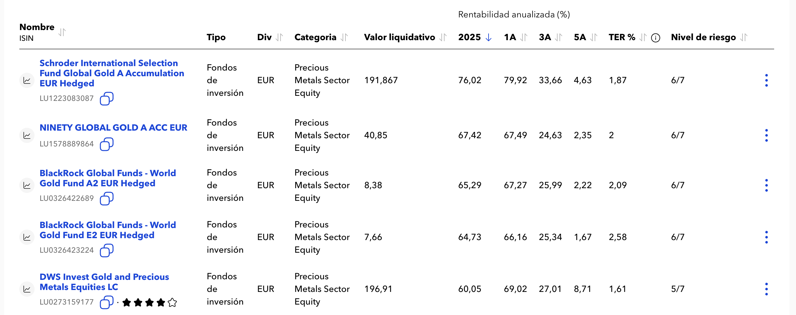
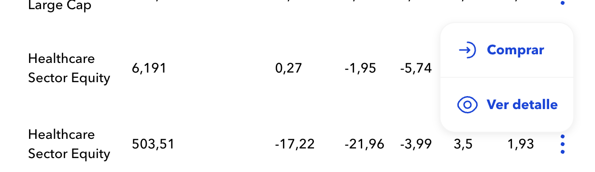
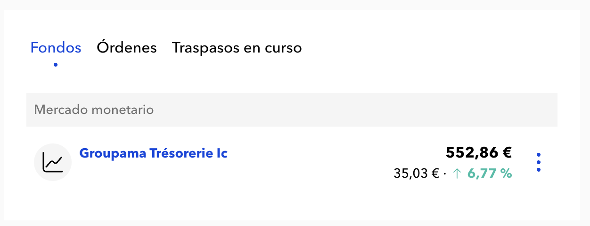
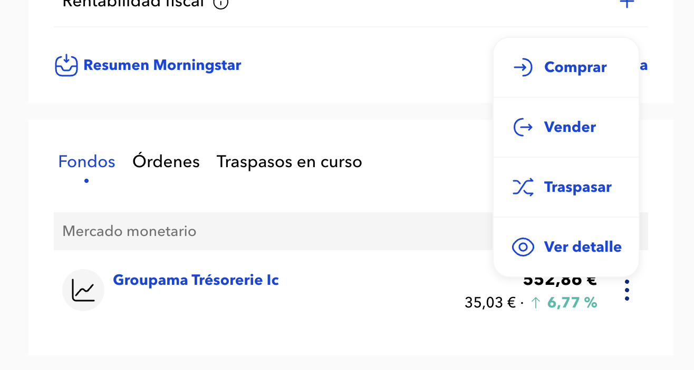

# 🧪 Prueba Técnica - Desarrollador Front-end

¡Gracias por tu interés en formar parte de nuestro equipo! Esta prueba técnica
está diseñada para evaluar tus habilidades como desarrollador Front-end en
aspectos como maquetación, consumo de APIs, buenas prácticas de código, y
atención al detalle.

## 🎯 Objetivo

La prueba consiste en desarrollar una solución en base a una propuesta inicial.
No esperamos que se dedique una jornada completa a su realización; con
aproximadamente 2 a 3 horas será suficiente para evaluar las capacidades
principales.

Esta prueba **no esta pensada para que sea terminada en el tiempo que
indicamos**, solo queremos valorar tus conocimientos y aptitudes.

## 🧰 Requisitos técnicos

- Utilizar **React** (con o sin frameworks como Next.js, Vite, etc.)
- En cuanto a los estilos, puedes utilizar la tecnología o herramienta con la
  que te sientas más cómodo/a: CSS, SASS, Styled-components, Vanilla-extract,
  entre otros.
- Uso de **JavaScript moderno (ES6+)**
- Se valorará positivamente el uso de TypeScript.
- Manejo de estado (React Hooks, Context API, etc.)
- Diseño responsive (mobile-first)
- Código limpio y bien estructurado
- Añadir tests, ya sean unitarios o de extremo a extremo (E2E), también será
  considerada como un punto a favor.

## ✅ Criterios de evaluación

- Organización y legibilidad del código
- Uso adecuado de componentes
- Manejo de estados y efectos
- Buenas prácticas de desarrollo (semántica, accesibilidad, etc.)
- Diseño responsive y visual atractivo
- Funcionamiento general de la app
- Uso de control de versiones (Git)

## 📦 Entregables

1. Un repositorio en GitHub (público o privado con acceso compartido)
2. Un archivo `README.md` explicando:

   - Cómo correr el proyecto localmente
   - Decisiones técnicas tomadas
   - Funcionalidades implementadas
   - Qué mejorarías si tuvieras más tiempo

## 🕒 Tiempo estimado

Recomendamos no dedicar más de **2-3 horas** en total. Valoramos más la calidad
del trabajo y el enfoque en los detalles que una solución completa.

## 💡 Tips

- Usa commits claros y descriptivos
- No te preocupes por usar un diseño perfecto; enfócate en la funcionalidad y
  orden del código
- Si usas librerías externas, justifica su uso

## ⚙️ Setup

- Node ^24.5.0
- Yarn o NPM

## 📖 Recursos proporcionados:

Facilitamos una API con varios endpoints que podrás utilizar para completar la
prueba. Puedes ver más información en este fichero [API.md](./API.md)

## 📝 Tareas

- Listado de fondos
- Acción de comprar un fondo
- Detalle de la cartera
- Acción de vender un fondo
- Acción de traspasar un fondo

El orden de la ejecución de las tareas es importante.

### Listado de fondos

Genera un tabla en la que se muestren todos los fondos, similar a la que
aparece en la imagen (No es necesario mostrar todas las columnas). Añadir la
acciones que se pueden realizar para cada item.

💡 Bonus:

- Paginación
- Paginación
- Ordenación de elementos al hacer click en la cabecera (ASC, DESC)
- Diseño responsive

### Acción de comprar

Añadir la posibilidad de realizar una compra de un fondo desde el listado. En
este caso no hay diseño, pero recomendamos hacer algo sencillo, pero que
funcione.

💡 Bonus:

- Validación de formularios:
    - No poder realizar compras superiores a 10.000 €
    - No poder realizar compras con valores negativos
- Uso de la etiqueta
  [dialog](https://developer.mozilla.org/en-US/docs/Web/HTML/Reference/Elements/dialog)
  de HTML
- Añadir un componente "input" que formateé la cantidad introducida. Por
  ejemplo "10,55 €".

### Detalle de la cartera

Generar una sección o pantalla, en la que se muestren todas la posiciones que
tiene el usuario, similar a la que aparece en la imagen. Solo es necesario
añadir el contenido de la pestaña "Fondos". Añadir la acciones que se pueden
realizar para cada item.

💡 Bonus:
- Ordenación por orden alfabetico
- Categorización por tipo de fondo
- Diseño responsive
- Añadir acciones en movil con "Swipe" en cada uno de los item
  ([iamge](./public/portfolio-mobile-actions.png))
- Añadir un historico de ordenes al hacer click en la pestaña "Órdenes"

### Acción de vender

Añadir la posibilidad de realizar una venta de un fondo desde el listado.

💡 Bonus:

- Validación de formularios:
    - Limitar la venta por una cantidad superior a la posición
    - No poder realizar ventas con valores negativos

## Acción de traspasar

Añadir la posibilidad de realizar una traspaso entre fondos.

💡 Bonus:

- Validación de formularios:
    - Limitar el traspaso por una cantidad superior a la posición
    - No poder realizar traspasos con valores negativos
    - No se puede traspasar al mismo fondo
    - Solo se debe permitir traspasar entre fondos ya comprados.
